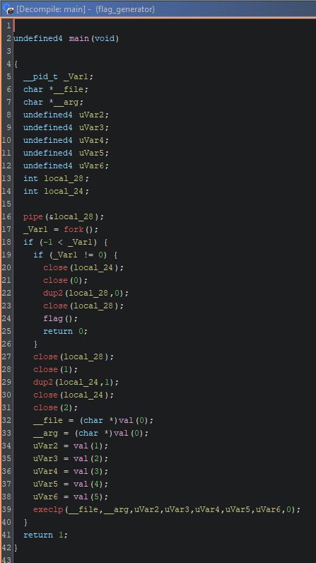
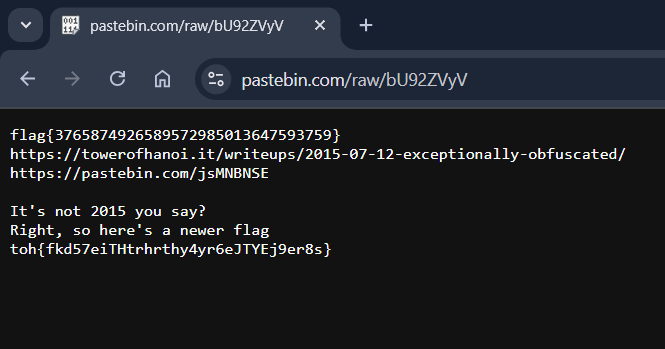

In this challenge, we are given a .xz archive containing an image file.

```bash
unxz image.xz
```

It's a 2GB raw disk image, so we start by scanning it with `fdisk` to obtain the list of partitions:

```bash
fdisk -l image

Disk image: 2.38 GiB, 2558525440 bytes, 4997120 sectors
Units: sectors of 1 * 512 = 512 bytes
Sector size (logical/physical): 512 bytes / 512 bytes
I/O size (minimum/optimal): 512 bytes / 512 bytes
Disklabel type: dos
Disk identifier: 0xbc471543

Device     Boot   Start     End Sectors  Size Id Type
image1            16384 1064959 1048576  512M  c W95 FAT32 (LBA)
image2          1064960 4997119 3932160  1.9G 83 Linux
```

The disk contains two partitions: the boot partition on _image1_ and the Linux **rootfs** on _image2_.

So we need to access the Linux partition, which requires us to calculate the offset and mount the filesystem.

$Offset = StartSector_{image2} \times SectorSize = 1064960 \times 512 = 545259520$

Now that we know the offset, let's mount the partition:

```bash
sudo mkdir /mnt/big
sudo mount -o loop,offset=545259520 image /mnt/big
ls /mnt/big

bin  boot  dev  etc  home  lib  lost+found  media  mnt  opt  proc  root  run  sbin  srv  sys  tmp  usr  var
```

Now we're inside the filesystem.

If we check `/home/pi` or `/root`, we won't find anything interesting. So, the next step is to look for files that have been recently modified. We use this command:

```bash
sudo find /mnt/big -type f -printf "%T@ %p\n" | sort -n | tail -20

1747095441.2619555010 /mnt/big/boot/initrd.img-6.12.25+rpt-rpi-v6
1747095451.9839914840 /mnt/big/boot/initrd.img-6.12.25+rpt-rpi-v7
1747095462.9610283330 /mnt/big/boot/initrd.img-6.12.25+rpt-rpi-v7l
1747095474.2840663540 /mnt/big/boot/initrd.img-6.12.25+rpt-rpi-v8
1747095474.4690669760 /mnt/big/etc/fake-hwclock.data
1747095474.5930673920 /mnt/big/etc/initramfs-tools/update-initramfs.conf
1747095474.5950673990 /mnt/big/etc/initramfs-tools/initramfs.conf
1747095474.6160674690 /mnt/big/etc/machine-id
1747095474.6210674860 /mnt/big/var/log/alternatives.log
1747095474.6220674900 /mnt/big/var/log/faillog
1747095474.6230674930 /mnt/big/var/log/dpkg.log
1747095474.6260675030 /mnt/big/var/log/wtmp
1747095474.6280675100 /mnt/big/var/log/apt/term.log
1747095474.6290675130 /mnt/big/var/log/apt/eipp.log.xz
1747095474.6310675200 /mnt/big/var/log/apt/history.log
1747095474.6320675230 /mnt/big/var/log/lastlog
1747095474.6340675300 /mnt/big/var/log/bootstrap.log
1747095474.6350675330 /mnt/big/var/log/btmp
1747095474.6410675530 /mnt/big/etc/rpi-issue
1752599747.3442750060 /mnt/big/usr/bin/flag_generator
```

Among the most interesting files, we have _flag_generator_, which is a 32-bit LSB ELF binary compiled for ARM.

```bash
file flag_generator

flag_generator: ELF 32-bit LSB executable, ARM, EABI5 version 1 (SYSV), dynamically linked, interpreter /lib/ld-linux-armhf.so.3, BuildID[sha1]=80b33423546c51bc55c70e721d7e4d70ba4c6900, for GNU/Linux 3.2.0, not stripped
```

We load the binary into Ghidra for static analysis.



The program works as follows:

- Creates a pipe and forks
- The parent redirects stdin to the pipe, then calls `flag()`
- The child redirects stdout to the pipe, closes stderr, and then calls the `val()` function 6 times to obtain parameters, which are passed to `execlp`

In short:  
The child launches a command (via `execlp`) and its output is read by the parent through the pipe and passed to `flag()`.

Let's analyze the `val()` function:

```c
/* val(int) */
void val(int param_1)
{
  char local_88;
  undefined1 local_87;
  undefined1 local_86;
  undefined1 local_85;
  undefined1 local_84;
  undefined1 local_83;
  undefined1 local_82;
  undefined1 local_81;
  undefined1 local_80;
  undefined1 local_7f;
  undefined1 local_7e;
  undefined1 local_7d;
  undefined1 local_7c;
  undefined1 local_7b;
  undefined1 local_7a;
  undefined1 local_79;
  undefined1 local_78;
  undefined1 local_77;
  undefined1 local_76;
  undefined1 local_75;
  undefined1 local_74;
  undefined1 local_73;
  undefined1 local_72;
  undefined1 local_71;
  undefined1 local_70;
  undefined1 local_6f;
  undefined1 local_6e;
  undefined1 local_6d;
  undefined1 local_6c;
  undefined1 local_6b;
  undefined1 local_6a;
  undefined1 local_69;
  undefined1 local_68;
  
  memset(&local_88,0,0x80);
  switch(param_1) {
  case 0:
    local_88 = 'w';
    local_87 = 0x67;
    local_86 = 0x65;
    local_85 = 0x74;
    break;
  case 1:
    local_87 = 0x71;
    goto LAB_00010f68;
  case 2:
    local_87 = 0x53;
    goto LAB_00010f68;
  case 3:
    local_87 = 0x4f;
LAB_00010f68:
    local_88 = '-';
    break;
  case 4:
    local_88 = '-';
    break;
  case 5:
    local_88 = 'h';
    local_87 = 0x74;
    local_86 = 0x74;
    local_85 = 0x70;
    local_84 = 0x73;
    local_83 = 0x3a;
    local_82 = 0x2f;
    local_81 = 0x2f;
    local_80 = 0x70;
    local_7f = 0x61;
    local_7e = 0x73;
    local_7d = 0x74;
    local_7c = 0x65;
    local_7b = 0x62;
    local_7a = 0x69;
    local_79 = 0x6e;
    local_78 = 0x2e;
    local_77 = 99;
    local_76 = 0x6f;
    local_75 = 0x6d;
    local_74 = 0x2f;
    local_73 = 0x72;
    local_72 = 0x61;
    local_71 = 0x77;
    local_70 = 0x2f;
    local_6f = 0x62;
    local_6e = 0x55;
    local_6d = 0x39;
    local_6c = 0x32;
    local_6b = 0x5a;
    local_6a = 0x56;
    local_69 = 0x79;
    local_68 = 0x56;
  }
  strdup(&local_88);
  return;
}
```

We notice that readable character values are assigned and, combined as an array, form:

`wget -q -S -O - https://pastebin.com/raw/bU92ZVyV`

Without going too deep into the details of what the program does, if you visit that URL you get:



`toh{fkd57eiTHtrhrthy4yr6eJTYEj9er8s}`