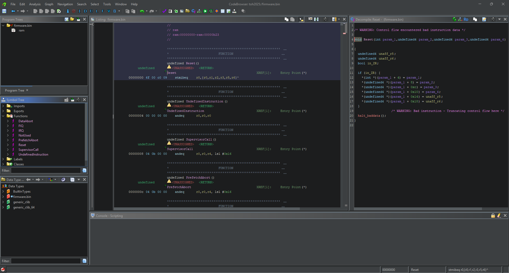

# Tiny Embedded System

This is the _tiny_ version of Embedded System.  
In this case, we need to analyze the firmware.

If we try both `file` and `binwalk`, they don't return any useful information.

```bash
file firmware.bin  
firmware.bin: data
```

```bash
binwalk firmware.bin 

DECIMAL       HEXADECIMAL     DESCRIPTION
--------------------------------------------------------------------------------

```

Trying instead with `strings`:

```bash
strings firmware.bin

0sP@
m?U7
E}57
37EI
a37EI
=;7EI
17EI
i17EI
`       u17
`       q97
97EI
97EI
u>7EI
67EI
!>7EI
`       ->7
`       )>7
`       )67
47EI
ch32-cpp-runtime booting
```

We notice the string `ch32-cpp-runtime`.  
Ch32 is a family of microcontrollers (MCUs), similar to Arduino or STM32.  
There are two types:

- CH32Fxxxx: These are basically STM32s, so they use the ARM Cortex architecture.
- CH32Vxxxx: These are the 32-bit RISC-V version.

We can try to disassemble the firmware with either ARM or RISC-V architecture in Ghidra.

For ARM:



Ghidra doesn't seem to return anything useful.

Trying instead to disassemble it as RISC-V:


Ghidra manages to disassemble it correctly.

The next step is to find the entrypoint of the firmware.  
Looking at the first bytes of the binary:

```assembly
00000000 6f              ??         6Fh
00000001 00              ??         00h
00000002 c0              ??         C0h                                            
00000003 09              ??         09h
```

This forms an opcode: `6f 00 c0 09`, which is `jal 0x09c0` (remember it's little-endian).  
This takes us to:

```assembly
000009c0 ef  f0  0f  f9    jal        ra,FUN_00000150
```

Which then leads to the function `FUN_00000150`, our entrypoint.


Analyzing `main`, we see it executes a _do-while_ loop containing 3 functions:

  
  


The functions `FUN_000000f6` and `FUN_0000010a` write the value 1 to very high memory addresses, which are most likely control registers of a hardware peripheral (such as GPIO, timer, etc). This is typical in embedded firmware to initialize or modify the state of a peripheral, for example by configuring a pin as output or enabling a line.

The really interesting part is the function `FUN_0000011e`.  
Analyzing the code, you notice it implements a `delay` routine: it updates memory-mapped registers, performs a polling loop on a time condition, and uses the `wfi()` (Wait For Interrupt) call to save energy during the wait.  
This is classic in embedded systems, where there are no standard sleep functions and you have to interact directly with hardware.

To draw a comparison: this is like a typical Arduino sketch that makes an LED blink:

```c
void loop() {
	digitalWrite(LED_PIN, HIGH);
    delay(1000);
    digitalWrite(LED_PIN, LOW);
    delay(1000);
}
```

In this case, the analyzed firmware behaves very similarly: it alternates register writes (probably turning something on or off) and hardware delays, just like the classic "Hello World" for embedded boards.

In short, what it does is turn an LED on and off.

However, we don't know where the flag is; it might be obfuscated somewhere or maybe accessible through UART, but checking the other functions, UART access is not implemented.

Exploring the disassembly, I noticed that starting from a function `LAB_0000034e`, there is a long sequence of `main` and `delay` calls, but not in a regular pattern.

Sometimes it alternates between `main` and `delay`, but in some cases after `main` it executes `delay` twice.

Also, the assignment of `a0` before `main` alternates between `0x32` and `0x96` in an arbitrary way.

The intuition comes from basic electronics (or the childhood trauma of programming Arduino):  
When using `digitalWrite` + `delay`, you make something blink.  
If the delays have different durations and alternate, it's usually to represent a _coded message_... like Morse code!

Analyzing the sequence:

- `0x96` = 150
    
- `0x32` = 50  
    this makes you think of a longer duration as a dash (–) and a shorter one as a dot (•),  
    Moreover, the use of two consecutive `delay` calls suggests the separation between words.
    

Taking this first part as an example:

```assembly
                             LAB_0000034e                                    XREF[1]:     00000330 (j)   
        0000034e 13  05  60  09    li         a0,0x96
        00000352 fd  3b           c.jal      main                                             undefined main()
        00000354 37  a5  24  00    lui        a0,0x24a
        00000358 13  05  05  f0    addi       a0,a0,-0x100
        0000035c c9  33           c.jal      delay                                            undefined delay()
        0000035e 37  45  49  00    lui        a0,0x494
        00000362 13  05  05  e0    addi       a0,a0,-0x200
        00000366 65  3b           c.jal      delay                                            undefined delay()
        00000368 13  05  60  09    li         a0,0x96
        0000036c d5  33           c.jal      main                                             undefined main()
        0000036e 37  a5  24  00    lui        a0,0x24a
        00000372 13  05  05  f0    addi       a0,a0,-0x100
        00000376 65  33           c.jal      delay                                            undefined delay()
        00000378 13  05  60  09    li         a0,0x96
        0000037c d1  3b           c.jal      main                                             undefined main()
        0000037e 37  a5  24  00    lui        a0,0x24a
        00000382 13  05  05  f0    addi       a0,a0,-0x100
        00000386 61  3b           c.jal      delay                                            undefined delay()
        00000388 13  05  60  09    li         a0,0x96
        0000038c d1  33           c.jal      main                                             undefined main()
        0000038e 37  a5  24  00    lui        a0,0x24a
        00000392 13  05  05  f0    addi       a0,a0,-0x100
        00000396 61  33           c.jal      delay                                            undefined delay()
        00000398 37  45  49  00    lui        a0,0x494
        0000039c 13  05  05  e0    addi       a0,a0,-0x200
        000003a0 bd  3b           c.jal      delay                                            undefined delay()
        000003a2 13  05  20  03    li         a0,0x32
        000003a6 6d  33           c.jal      main                                             undefined main()
        000003a8 37  a5  24  00    lui        a0,0x24a
        000003ac 13  05  05  f0    addi       a0,a0,-0x100
        000003b0 bd  33           c.jal      delay                                            undefined delay()
        000003b2 13  05  20  03    li         a0,0x32
        000003b6 69  3b           c.jal      main                                             undefined main()
        000003b8 37  a5  24  00    lui        a0,0x24a
        000003bc 13  05  05  f0    addi       a0,a0,-0x100
        000003c0 b9  3b           c.jal      delay                                            undefined delay()
        000003c2 13  05  20  03    li         a0,0x32
        000003c6 69  33           c.jal      main                                             undefined main()
        000003c8 37  a5  24  00    lui        a0,0x24a
        000003cc 13  05  05  f0    addi       a0,a0,-0x100
        000003d0 b9  33           c.jal      delay                                            undefined delay()
        000003d2 13  05  20  03    li         a0,0x32
        000003d6 ad  3b           c.jal      main                                             undefined main()
        000003d8 37  a5  24  00    lui        a0,0x24a
        000003dc 13  05  05  f0    addi       a0,a0,-0x100
        000003e0 3d  3b           c.jal      delay                                            undefined delay()
        000003e2 37  45  49  00    lui        a0,0x494
        000003e6 13  05  05  e0    addi       a0,a0,-0x200
        000003ea 15  3b           c.jal      delay                                            undefined delay()
```

This forms "**toh**", which is the flag prefix.

Once you understand the Morse code mechanism, all that's left is to copy the relevant assembly code, paste it into a file, and write a Python script to decode the Morse code text.

```python
#!/usr/bin/env python3

morse = {
    '.-': 'a', '-...': 'b', '-.-.': 'c', '-..': 'd', '.': 'e',
    '..-.': 'f', '--.': 'g', '....': 'h', '..': 'i', '.---': 'j',
    '-.-': 'k', '.-..': 'l', '--': 'm', '-.': 'n', '---': 'o',
    '.--.': 'p', '--.-': 'q', '.-.': 'r', '...': 's', '-': 't',
    '..-': 'u', '...-': 'v', '.--': 'w', '-..-': 'x', '-.--': 'y',
    '--..': 'z', '.----': '1', '..---': '2', '...--': '3', '....-': '4',
    '.....': '5', '-....': '6', '--...': '7', '---..': '8', '----.': '9', '-----': '0'
}

import sys 

if len(sys.argv) != 2:
    print(f'Usage: python {sys.argv[0]} <assembly_file>')
    sys.exit(1)

with open(sys.argv[1]) as f:
    lines = f.readlines()

seq = []
letter = ""

for line in lines:
    if 'li         a0,0x96' in line:    # DASH
        letter += "-"
    elif 'li         a0,0x32' in line: # DOT
        letter += "."
    elif 'lui         a0,0x494' in line: # SPACE
        if letter:
            seq.append(letter)
            letter = ""
if letter:
    seq.append(letter)
    
flag = ''.join(morse.get(x, '?') for x in seq)
print("{%s}" % flag)
```

The printed flag will be `toh53gg56hy7u732vb56h2g`

`toh{53gg56hy7u732vb56h2g}`